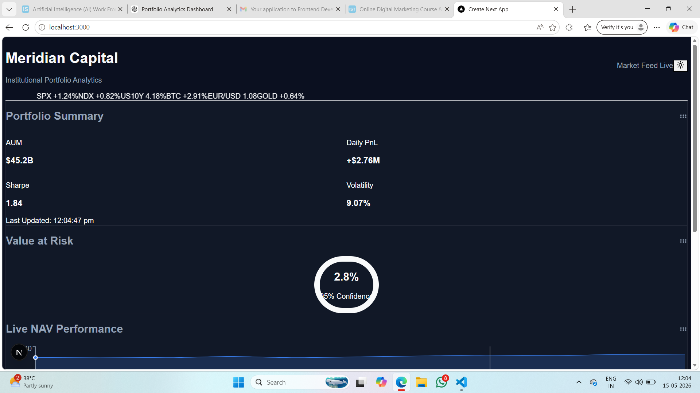
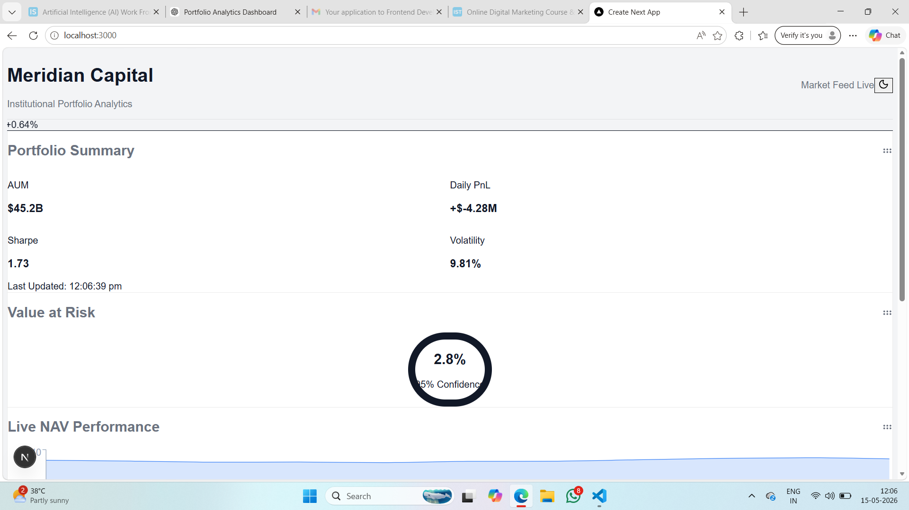

# Meridian Capital — Institutional Portfolio Analytics Dashboard

A production-style institutional portfolio analytics platform inspired by Bloomberg Terminal, Refinitiv Eikon, and Grafana.

Built using React 18, Next.js 14, TypeScript, AG Grid, Recharts, Zustand, and React Grid Layout.

---

## Features

### Institutional Dashboard UI
- Bloomberg-style dark theme
- Light/dark mode switching
- Fully responsive dashboard shell
- Drag-and-drop widget system

### Portfolio Analytics
- Portfolio summary metrics
- Real-time NAV performance chart
- Value at Risk (VaR) monitoring
- Drawdown analysis
- Correlation matrix heatmap

### Enterprise Data Visualization
- Recharts live analytics
- AG Grid institutional tables
- Interactive financial widgets
- Real-time market feed simulation

### Engineering Architecture
- React 18 + Next.js 14
- TypeScript strict mode
- Zustand state management
- Widget registry architecture
- Modular scalable folder structure

### Performance & UX
- Draggable/resizable layouts
- Layout persistence
- Optimized rendering
- Smooth animations with Framer Motion

---

## Screenshots

### Dashboard (Dark Mode)



### Dashboard (Light Mode)



---

## Tech Stack

- React 18
- Next.js 14
- TypeScript
- Tailwind CSS
- Zustand
- Recharts
- AG Grid
- Framer Motion
- React Grid Layout

---

## Installation

```bash
git clone <your-repository>
cd meridian-dashboard
npm install
npm run dev
```

---

## Future Enhancements

- WebSocket integration
- Storybook component library
- Brinson attribution analytics
- Stress testing engine
- Multi-workspace layouts
- Role-based dashboards

---

## Author

R. Suvarna